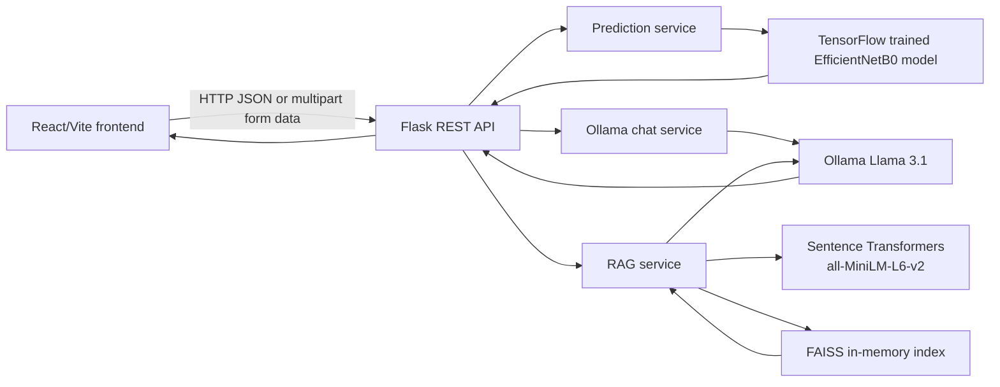

# RoadSense AI Backend

The RoadSense AI backend is a Flask REST API for an intelligent road issue detection and RAG AI assistant platform. It receives requests from the separate RoadSense AI React frontend, performs trained-model inference for road images, sends chat prompts to a local Ollama service, and manages document ingestion and retrieval-augmented question answering.

This repository is a separated portfolio backend derived from the backend component of a COMP258 educational team project originally developed at Centennial College. The original platform was team-developed; this repository does not represent the complete team project as individual work. The separation is intended to make the backend easier to review and maintain alongside the standalone frontend repository.

## Project Overview

The backend exposes the server-side capabilities used by RoadSense AI:

- Flask API routes consumed by the React frontend.
- Road issue image prediction using a trained TensorFlow model based on EfficientNetB0.
- Local AI chat through Ollama and the Llama 3.1 model.
- Upload and text extraction for PDF, TXT, and DOCX documents.
- Retrieval-augmented question answering using Sentence Transformer embeddings and an in-memory FAISS index.

The backend does not contain the React application, ML training notebooks, training datasets, or the trained model artifact. Those are separate concerns and are documented as runtime dependencies where applicable.

## System Architecture



For image analysis, the frontend sends an image to Flask, the prediction service preprocesses it to 224 x 224 RGB input, and the trained TensorFlow model returns one of seven configured road issue classes with a confidence value.

For normal chat, Flask sends the message to Ollama. For RAG, the backend extracts text from the uploaded document, chunks it, embeds the chunks, indexes them with FAISS, retrieves the most relevant chunks for a question, and sends the retrieved context to Ollama for an answer.

## API Endpoints

All routes are defined in `app.py` and are prefixed with `/api`.

### `GET /api/health`

Returns a simple service check:

```json
{"status": "ok"}
```

### `GET /api/examples/documents`

Enumerates supported bundled RAG examples under `examples/documents`. Hidden files, metadata files, temporary files, and unsupported extensions are excluded. The response contains safe metadata only:

```json
{
	"documents": [
		{
			"filename": "Transport-Canada-Road-Safety-2025.pdf",
			"title": "Transport Canada Road Safety Report",
			"extension": "pdf",
			"size_bytes": 469867,
			"suggested_questions": ["..."],
			"url": "/api/examples/documents/Transport-Canada-Road-Safety-2025.pdf"
		}
	]
}
```

`GET /api/examples/documents/<filename>` serves a selected document by safe basename for browser preview and frontend example upload. It rejects path traversal and unsupported files.

### `GET /api/examples/images`

Discovers backend-owned image metadata once per file-signature change, then randomly selects up to two different images for each verified model class. The response normally contains 14 images: two each for Broken Road Sign Issues, Damaged Road issues, Illegal Parking Issues, Littering Garbage on Public Places Issues, Mixed Issues, Pothole Issues, and Vandalism Issues. The frontend filters this already-selected response locally; changing a category does not refetch or reshuffle it.

The image serving route is `GET /api/examples/images/<relative-name>`. It validates that the resolved path remains under `examples/images`, returns one static image, and sends browser cache headers for one day. Example metadata does not load images, run TensorFlow, or perform RAG processing.

### `POST /api/predict`

Accepts `multipart/form-data` with an image in the `image` field. The image is decoded, converted to RGB, resized to 224 x 224, preprocessed with the EfficientNet preprocessing function, and passed to the loaded TensorFlow model.

Successful responses have this shape:

```json
{
	"class_name": "Pothole Issues",
	"confidence": 0.9672
}
```

The configured classes are Broken Road Sign Issues, Damaged Road issues, Illegal Parking Issues, Littering Garbage on Public Places Issues, Mixed Issues, Pothole Issues, and Vandalism Issues.

### `POST /api/chat`

Accepts JSON containing a `message` string:

```json
{"message": "How are potholes formed?"}
```

The message is sent to Ollama using the `llama3.1` model. The response is returned as:

```json
{"response": "..."}
```

### `POST /api/rag/upload`

Accepts `multipart/form-data` with a document in the `file` field. The implementation supports PDF, TXT, DOC, and DOCX extensions. The response reports the number of indexed chunks:

```json
{"status": "ok", "chunks_loaded": 22}
```

The uploaded file is saved under the runtime `uploads/` directory. Upload processing is local to the running process and the FAISS index is held in memory.

### `POST /api/rag/ask`

Accepts JSON containing a non-empty `question` string:

```json
{"question": "Summarize the uploaded document."}
```

The service retrieves the top five indexed chunks and asks Ollama to answer using that context. The response has this shape:

```json
{"answer": "..."}
```

### `POST /api/rag/questions`

After a document is indexed, this endpoint asks the configured Ollama model to generate exactly five concise questions grounded in the indexed document chunks. It returns:

```json
{"questions": ["What does the document say about road safety?"]}
```

If Ollama is unavailable or no document has been indexed, the endpoint returns HTTP 503 and the frontend falls back to document metadata questions when available.

## RAG Pipeline

The implemented RAG flow is:

```text
Uploaded PDF/TXT/DOC/DOCX
	-> PyPDF2, standard text reading, or docx2txt extraction
	-> whitespace-based chunks of approximately 800 characters
	-> all-MiniLM-L6-v2 Sentence Transformer embeddings
	-> in-memory FAISS IndexFlatL2 index
	-> top-five context retrieval for a question
	-> Ollama Llama 3.1 response
```

The current index and document chunks are process memory. Restarting the Flask process clears the index; uploaded files may remain in `uploads/` unless they are removed separately.

## Backend Structure

```text
RoadSense-AI-Backend/
├── examples/
│   ├── images/
│   │   ├── Public-Cleanliness-and-Environmental-Issues/
│   │   │   ├── Littering-Garbage-on-Public-Places-Issues/
│   │   │   └── Vandalism-Issues/
│   │   └── Road-Issues/
│   │       ├── Broken-Road-Sign-Issues/
│   │       ├── Damaged-Road-issues/
│   │       ├── Illegal-Parking-Issues/
│   │       ├── Mixed-Issues/
│   │       └── Pothole-Issues/
│   └── documents/
│       ├── British-Columbia-Roads-Report-2018.pdf
│       ├── Transport-Canada-Road-Safety-2025.pdf
│       └── metadata.json
├── services/
│   ├── __init__.py
│   ├── model_service.py
│   ├── ollama_service.py
│   └── rag_service.py
├── .env.example
├── .gitignore
├── app.py
├── README.md
└── requirements.txt
```

The `uploads/` directory is created automatically when the RAG service starts. The `models/` directory contains the ignored local runtime copy of the trained model. The bundled PDFs are copies of documents previously uploaded in the original AsphaltAegis team project backend. The downloaded RoadSense-AI archive contains no documents, and the exact Ontario/Transport Canada filenames proposed during planning were not present in this workspace. Titles, provenance notes, and suggested questions are maintained in `examples/documents/metadata.json`; adding another supported document plus one metadata entry makes it appear automatically in the API response.

Bundled road images are owned by this backend under `examples/images`. `GET /api/examples/images` recursively discovers supported JPG, JPEG, PNG, and WebP files and maps the verified folder names to the seven model classes. `GET /api/examples/images/<relative-name>` serves an image only when the resolved path remains inside `examples/images`. Add a valid image under an existing category folder and refresh the frontend to include it automatically; no React card changes are required. Runtime uploads remain separate under `uploads/` and are never included in example discovery.

## Technology Stack

### Runtime backend

- Python
- Flask
- Flask-CORS
- Requests
- python-dotenv
- PyPDF2 and docx2txt for document extraction

### Runtime ML and AI services

- TensorFlow for loading and running the trained image classifier
- EfficientNetB0-based trained `.keras` model
- Pillow and NumPy for image preprocessing
- Sentence Transformers with `all-MiniLM-L6-v2` for embeddings
- FAISS CPU index for vector retrieval
- Ollama serving Llama 3.1 locally

### Separate training materials

The source project also contains ML notebooks, dataset split files, and training/evaluation scripts. They are not required by this inference API at runtime and were intentionally excluded from this repository.

## Installation

### Prerequisites

- Python 3.10 or newer, matching the original project documentation.
- A compatible TensorFlow installation for the selected operating system and Python version.
- Ollama installed locally or reachable at a configured URL.
- The Ollama `llama3.1` model pulled before using chat or RAG:

```bash
ollama pull llama3.1
```

### Create an environment and install dependencies

From the repository root:

```bash
python -m venv .venv
```

Activate it on Windows:

```powershell
.\.venv\Scripts\Activate.ps1
```

Activate it on macOS/Linux:

```bash
source .venv/bin/activate
```

Install the backend dependencies:

```bash
python -m pip install --upgrade pip
python -m pip install -r requirements.txt
```

### Configure the backend

Copy `.env.example` to `.env` and adjust values if needed:

```text
MODEL_PATH=models/efficientnet_best_model.keras
OLLAMA_URL=http://localhost:11434/api/generate
OLLAMA_MODEL=llama3.1
```

The application loads `.env` through `python-dotenv` before importing services. Do not place credentials in `.env.example` or commit a real `.env` file.

## Model Dependency

The active `services/model_service.py` loads a trained TensorFlow `.keras` model during application import. The ML repository is the logical owner of this artifact. The original project stored it at:

```text
ml/saved_model/efficientnet_best_model.keras
```

The ML repository now contains the model at `RoadSense-AI-ML/models/efficientnet_best_model.keras`. The backend also supports a local runtime copy at:

```text
models/efficientnet_best_model.keras
```

Alternatively, set `MODEL_PATH` to the ML repository model or another existing model file. The model is required even for health-check startup because it is loaded when the Flask application imports its prediction service. Training datasets and notebooks are not required for inference.

The current backend checkout includes an ignored local copy under `models/` so it can run independently. Keep that copy synchronized with the ML repository model, or point `MODEL_PATH` directly to the ML-owned artifact to avoid maintaining two model versions.

The TensorFlow model is loaded once during backend import and receives one warm-up inference using its verified `(1, 224, 224, 3)` input shape. Prediction requests reuse that in-memory model and only decode, preprocess, and predict the submitted image.

## Starting the Flask Server

After the model and Python dependencies are available:

```bash
python app.py
```

The development server listens on port `5000`, and the health endpoint is available at `http://127.0.0.1:5000/api/health`.

The RAG service also loads `all-MiniLM-L6-v2` during import. If the embedding model is not already cached, Sentence Transformers downloads it from its model registry during first startup, so network access may be required. Ollama must be running separately for `/api/chat` and `/api/rag/ask` responses.

RAG knowledge uploads accept only PDF, TXT, DOC, and DOCX files. Image files belong to `/api/predict` and are rejected by the RAG endpoint with HTTP 400.

## Frontend Integration

The standalone `RoadSense-AI-Frontend` React application sends requests to this API. Its current source uses:

- `${VITE_API_BASE_URL}/api/predict` for image prediction
- `${VITE_API_BASE_URL}/api/chat` for normal chat
- `${VITE_API_BASE_URL}/api/rag/upload` for document upload
- `${VITE_API_BASE_URL}/api/rag/ask` for RAG questions

Flask-CORS is enabled by the current application, allowing the Vite development frontend to call the backend during local development. The frontend defaults to `http://localhost:5000` and can be configured with `VITE_API_BASE_URL`.

## Configuration and Runtime Data

Supported configuration variables in this separated backend are:

| Variable | Default | Purpose |
| --- | --- | --- |
| `MODEL_PATH` | `models/efficientnet_best_model.keras` | Location of the trained TensorFlow model |
| `OLLAMA_URL` | `http://localhost:11434/api/generate` | Ollama text-generation endpoint |
| `OLLAMA_MODEL` | `llama3.1` | Ollama model name used for chat and RAG answers |

Uploaded RAG documents are written to `uploads/`, which is ignored by Git. The FAISS index and extracted chunks are in memory and are not persisted between process restarts.

## Attribution

RoadSense AI is a reorganized portfolio version of the AsphaltAegis COMP258 educational team project originally developed at Centennial College. The original project documentation credits Numaan Baig, Anmol, Raj Patel, Juan, Jaturaput, Daniela, and Abdallah. This repository separates the backend component for portfolio presentation and maintainability; it does not claim individual ownership of the complete original team project.

The original documentation describes the project as educational software and does not present it as verified production software. Model predictions should be treated as decision support and reviewed by people familiar with the relevant road context.
